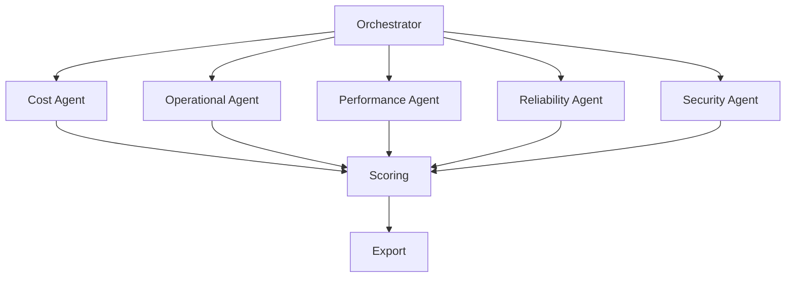

# Backend Agent Implementation & Orchestrator Walkthrough

This document provides a step-by-step walkthrough of a typical pillar agent (e.g., Cost Agent) and explains how the orchestrator coordinates agent execution in the Azure Well-Architected Agents backend.

---

## 1. Pillar Agent Structure

Each agent (e.g., `cost_agent.py`) inherits from `pillar_agent_base.py` and implements pillar-specific logic:

```python
# cost_agent.py (simplified)
from .pillar_agent_base import PillarAgentBase
from .cost_constants import COST_CRITERIA

class CostAgent(PillarAgentBase):
    def __init__(self, input_data):
        super().__init__(input_data)
        self.criteria = COST_CRITERIA

    def analyze(self):
        # Custom logic for cost optimization
        findings = self._extract_cost_findings()
        score = self._score_findings(findings)
        return score, findings
```

- **Constants**: Each agent uses pillar-specific constants for scoring.
- **analyze()**: Main method for pillar evaluation.

---

## 2. Orchestrator Flow

The orchestrator (`orchestrator.py`) manages the overall assessment process:

```python
# orchestrator.py (simplified)
from .agents.cost_agent import CostAgent
from .agents.operational_agent import OperationalAgent
# ... other agents

class Orchestrator:
    def __init__(self, normalized_data):
        self.data = normalized_data
        self.agents = [
            CostAgent(self.data),
            OperationalAgent(self.data),
            # ... other agents
        ]

    def run_assessment(self):
        results = {}
        for agent in self.agents:
            score, findings = agent.analyze()
            results[agent.__class__.__name__] = {
                'score': score,
                'findings': findings
            }
        return results
```

- **Agent Instantiation**: All agents are initialized with normalized data.
- **run_assessment()**: Invokes each agent, collects scores and findings.

---

## 3. Scoring & Export

After agent evaluation, scoring modules aggregate results and export them:

- `scoring.py`: Aggregates scores, applies thresholds from JSON criteria.
- `excel_export.py`: Exports results to Excel for reporting.

---

## 4. Example Component Diagram



---

For error handling and configuration, see the respective documentation files.