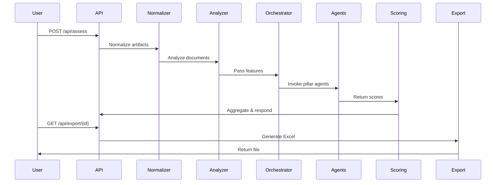

# Backend API Endpoints & Service Flow

This document describes the main API endpoints and service flow for the Azure Well-Architected Agents backend. It helps developers understand how requests are processed and how the backend orchestrates agentic assessments.

---

## 1. API Endpoints (Typical)

> Note: Actual endpoints may vary depending on the web framework (Flask, FastAPI, etc.) and implementation in `server.py`.

### Assessment Submission
- **POST /api/assess**
  - Accepts architecture artifacts (documents, diagrams, configs)
  - Triggers normalization, analysis, and agent evaluation
  - Returns assessment results (scores, recommendations)

### Progress Tracking
- **GET /api/progress/{assessment_id}**
  - Returns current status and progress of an assessment

### Export Results
- **GET /api/export/{assessment_id}**
  - Exports results in Excel or other formats

### Health Check
- **GET /api/health**
  - Returns backend service status

---

## 2. Service Flow

1. **Request Received**: User submits an assessment request via `/api/assess`.
2. **Artifact Normalization**: `artifact_normalizer.py` standardizes input data.
3. **Document Analysis**: `document_analyzer.py` extracts features and insights.
4. **Orchestration**: `orchestrator.py` coordinates agent invocation for each pillar.
5. **Agent Evaluation**: Each agent processes data, applies pillar-specific logic, and generates scores/recommendations.
6. **Scoring**: `scoring.py` and/or `hybrid_llm_scorer.py` aggregate and finalize scores using criteria from JSON files.
7. **Progress Tracking**: `progress_api.py` monitors assessment status.
8. **Export**: Results can be exported via `/api/export/{assessment_id}` using `excel_export.py`.

---

## 3. Example Sequence Diagram

---

## 4. Notes
- Endpoints may be versioned (e.g., `/v1/api/assess`).
- Authentication and authorization should be implemented for production use.
- Error responses are handled centrally (see error handling documentation).

---

For more details, see the agent walkthrough and error handling documentation.