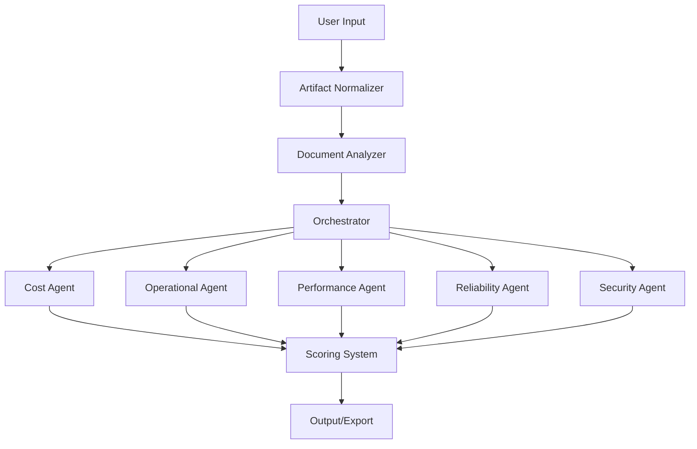

# Azure Well-Architected Agents: Backend Detailed Design Document

## 1. High-Level Architecture

The backend is a modular Python system for automated Azure Well-Architected Framework (WAF) assessments. It leverages agent-based analysis, LLM-powered scoring, and structured configuration to deliver actionable recommendations across five pillars: Cost, Operational Excellence, Performance, Reliability, and Security.

---

## 2. Main Entry Points

- **server.py**: Likely the main API or service entry, initializing the backend, exposing endpoints, and orchestrating requests.
- **app/**: Contains the core business logic, agent orchestration, scoring, and integrations.
- **utils/**: Provides environment and utility functions for cross-cutting concerns.

---

## 3. Core Components

### 3.1. Agent System (`app/agents/`)

**Purpose:**  
Implements each WAF pillar as a dedicated agent, encapsulating pillar-specific logic and configuration.

**Files:**
- `pillar_agent_base.py`: Abstract base class for all agents, defines shared interfaces and lifecycle methods.
- `cost_agent.py`, `operational_agent.py`, `performance_agent.py`, `reliability_agent.py`, `security_agent.py`: Concrete agent implementations for each pillar.
- `*_constants.py`: Pillar-specific constants, scoring weights, and configuration.

**Design:**  
Agents inherit from the base class, use constants for configuration, and are invoked by the orchestrator. Each agent can process input artifacts, apply scoring, and generate recommendations.

---

### 3.2. Analysis Pipeline (`app/analysis/`)

**Purpose:**  
Processes and normalizes input artifacts, coordinates document analysis, and manages the flow of data to agents.

**Files:**
- `artifact_normalizer.py`: Standardizes and validates input data (e.g., architecture diagrams, requirements).
- `document_analyzer.py`: Extracts features and insights from documents.
- `orchestrator.py`: Central controller that manages the analysis workflow, invokes agents, and aggregates results.

**Design:**  
The orchestrator receives normalized artifacts, passes them to the document analyzer, and then dispatches them to the appropriate agents for pillar-specific evaluation.

---

### 3.3. Scoring System (`app/scoring/`, `utils/scoring/`)

**Purpose:**  
Implements scoring logic, aggregates results, and leverages LLMs for hybrid scoring and recommendations.

**Files:**
- `hybrid_llm_scorer.py`: Integrates LLMs (e.g., Azure OpenAI) for advanced scoring and contextual recommendations.
- `scoring.py`: Core scoring logic, aggregates agent outputs, applies pillar criteria.
- `*_pillar.json`: Defines scoring criteria, thresholds, and rules for each pillar.

**Design:**  
Scoring is modular, allowing for rule-based, LLM-based, or hybrid approaches. Criteria are externalized in JSON for easy updates.

---

### 3.4. Integration & Services (`app/services/`, `app/config/`)

**Purpose:**  
Handles external integrations (LLMs, Azure services) and configuration management.

**Files:**
- `llm_provider.py`: Abstracts LLM interactions, supports prompt management and response parsing.
- `azure_openai.py`: Manages Azure OpenAI configuration and credentials.

---

### 3.5. Prompts (`app/prompts/`)

**Purpose:**  
Stores prompt templates for each agent, guiding LLM interactions and ensuring consistent analysis.

**Files:**
- `*_agent_instructions.txt`: Text prompts for each pillar agent.

---

### 3.6. Utilities (`app/utils/`, `utils/`)

**Purpose:**  
Provides reusable functions for CLI operations, logging, environment management, and cross-cutting concerns.

**Files:**
- `cli_utils.py`: Command-line interface helpers.
- `logging_config.py`: Centralized logging setup.
- `env_utils.py`: Environment variable and configuration management.

---

### 3.7. Concepts & Domain Knowledge (`utils/concepts/`)

**Purpose:**  
Stores domain-specific knowledge and expected concepts for reliability and other pillars.

**Files:**
- `reliability_expected_concepts.json`: Reference concepts for reliability analysis.

---

### 3.8. Export & Progress (`app/excel_export.py`, `app/progress_api.py`)

**Purpose:**  
Exports results to Excel and tracks progress of assessments.

---

## 4. Data Flow

1. **Input**: User submits architecture artifacts (documents, diagrams, configs).
2. **Normalization**: `artifact_normalizer.py` standardizes inputs.
3. **Analysis**: `document_analyzer.py` extracts features.
4. **Orchestration**: `orchestrator.py` coordinates agent invocation.
5. **Agent Evaluation**: Each agent processes data, applies pillar-specific logic, and generates scores/recommendations.
6. **Scoring**: `scoring.py` and/or `hybrid_llm_scorer.py` aggregate and finalize scores using criteria from JSON files.
7. **Output**: Results exported (Excel, API response), progress tracked.

---

## 5. Extensibility

- **Agents**: Add new pillars by extending `pillar_agent_base.py` and creating new agent modules.
- **Scoring**: Update or add new scoring strategies via JSON criteria or LLM integration.
- **Prompts**: Refine analysis by updating prompt templates.
- **Integrations**: Easily add new cloud or LLM providers via service abstraction.

---

## 6. Error Handling & Logging

- Centralized via `logging_config.py`.
- Orchestrator and agents should propagate errors for unified handling.

---

## 7. Security & Configuration

- Sensitive configs managed via `env_utils.py` and `azure_openai.py`.
- Prompts and scoring criteria externalized for auditability.

---

## 8. Recommendations for Developers

- **Follow the agent base class for new pillars.**
- **Update scoring criteria in JSON for non-code changes.**
- **Use logging and CLI utilities for debugging and automation.**
- **Document new prompt templates and agent logic.**

---

## 9. Example Workflow

---

## 10. Summary

The backend is a robust, extensible, and modular system for automated Azure WAF assessments. Its agent-based architecture, hybrid scoring, and clear separation of concerns make it easy for developers to maintain, extend, and integrate with new technologies.

---

Let me know if you need a code-level walkthrough, API contract details, or a focus on a specific pillar or integration!
