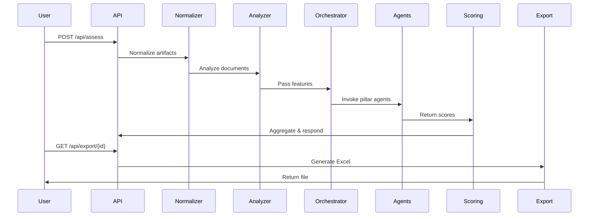
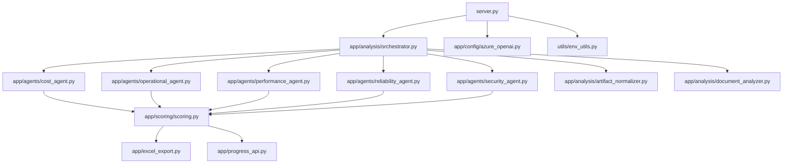

# Backend Diagrams

This document provides visual diagrams to help developers understand the architecture and workflow of the Azure Well-Architected Agents backend.

---

## 1. Sequence Diagram: Assessment Request

---

## 2. Component Diagram: Backend Modules

---

## 3. Data Flow Diagram (Text)

- User submits assessment request
- API receives and validates input
- Artifacts normalized
- Documents analyzed
- Orchestrator coordinates agent execution
- Agents evaluate pillars and return scores
- Scoring module aggregates results
- Results exported and progress tracked

---

For more details, see the other documentation files in this directory.