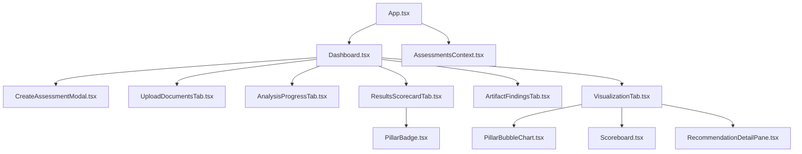

# Azure Well-Architected Agents: Frontend Detailed Design Document

## 1. Overview

The frontend is a modern React (TypeScript) application, built with Vite for fast development and optimized builds. It provides an interactive dashboard for uploading artifacts, tracking assessment progress, visualizing results, and exploring recommendations across Azure Well-Architected pillars.

---

## 2. Main Entry Points

- **index.html**: HTML template for the SPA.
- **main.tsx**: Application bootstrap, renders `App.tsx`.
- **App.tsx**: Root component, sets up routing, context, and layout.

---

## 3. Core Functionalities & Components

### 3.1. Assessment Lifecycle

- **CreateAssessmentModal.tsx**: Modal for starting a new assessment, collects user input and triggers backend API.
- **UploadDocumentsTab.tsx**: UI for uploading architecture artifacts (documents, diagrams).
- **AnalysisProgressTab.tsx**: Displays real-time progress of the assessment, polling backend for updates.
- **AssessmentDetail.tsx**: Shows details of a specific assessment, including findings and scores.

**Context Management:**  
- **AssessmentsContext.tsx**: React context for managing assessment state, API calls, and updates across components.

---

### 3.2. Results & Visualization

- **ResultsScorecardTab.tsx**: Presents scores for each WAF pillar, with badges and summary.
- **ArtifactFindingsTab.tsx**: Lists findings extracted from uploaded artifacts.
- **PillarBadge.tsx**: Visual badge for each pillar, indicating status or score.

**Visualization Suite (`visualization/`):**
- **PillarBubbleChart.tsx**: Interactive bubble chart visualizing pillar scores and relationships.
- **Scoreboard.tsx**: Displays overall and per-pillar scores.
- **RecommendationDetailPane.tsx**: Shows detailed recommendations for improvement.
- **VisualizationTab.tsx**: Container for all visualizations, allows switching between views.

---

### 3.3. Dashboard & Navigation

- **Dashboard.tsx**: Main landing page, aggregates assessment summaries, quick actions, and navigation.
- **ConnectionStatus.tsx**: Shows backend/API connectivity status.

---

### 3.4. API Integration

- **api/service.ts**: Handles all API requests to the backend (assessment creation, progress, results, uploads).
- **mock/api.ts**: Provides mock data for development and testing.

---

### 3.5. Constants, Types, and Utilities

- **constants/wafLinks.ts**: External links and references for WAF documentation.
- **types.ts**: Shared TypeScript types for assessments, findings, scores, etc.
- **visualization/types.ts**: Types specific to visualization components.
- **visualization/utils.ts**: Helper functions for data transformation and chart logic.

---

### 3.6. Styling & Theming

- **global.css**: Global styles for the app.
- **styles/wafLinks.css**: Styles for WAF links and related UI.
- **theme.ts**: Centralized theme configuration (colors, spacing, etc.).

---

## 4. Data Flow

1. **User Action**: User creates an assessment and uploads artifacts.
2. **API Call**: Frontend sends data to backend via `service.ts`.
3. **Progress Tracking**: `AnalysisProgressTab.tsx` polls backend for status.
4. **Results Display**: Once complete, results are shown in `ResultsScorecardTab.tsx`, `ArtifactFindingsTab.tsx`, and visualizations.
5. **Recommendations**: Detailed improvement suggestions are shown in `RecommendationDetailPane.tsx`.

---

## 5. Extensibility

- **Add new pillars**: Update types, badges, and visualization logic.
- **Integrate new visualizations**: Add components to `visualization/` and update `VisualizationTab.tsx`.
- **API changes**: Update `service.ts` and context logic.

---

## 6. Example Component Diagram

---

## 7. Recommendations for Developers

- Use context for state management across assessment-related components.
- Keep types up to date for API responses and visualization data.
- Modularize new features in their own folders (e.g., `visualization/`, `components/`).
- Use mock API for rapid prototyping and testing.

---

## 8. Summary

The frontend is a modular, extensible React app designed for interactive Azure WAF assessments. Its clear separation of concerns, context-driven state management, and rich visualization suite make it easy to maintain and extend.

---

Let me know if you want code-level walkthroughs, UI/UX diagrams, or details on a specific component!